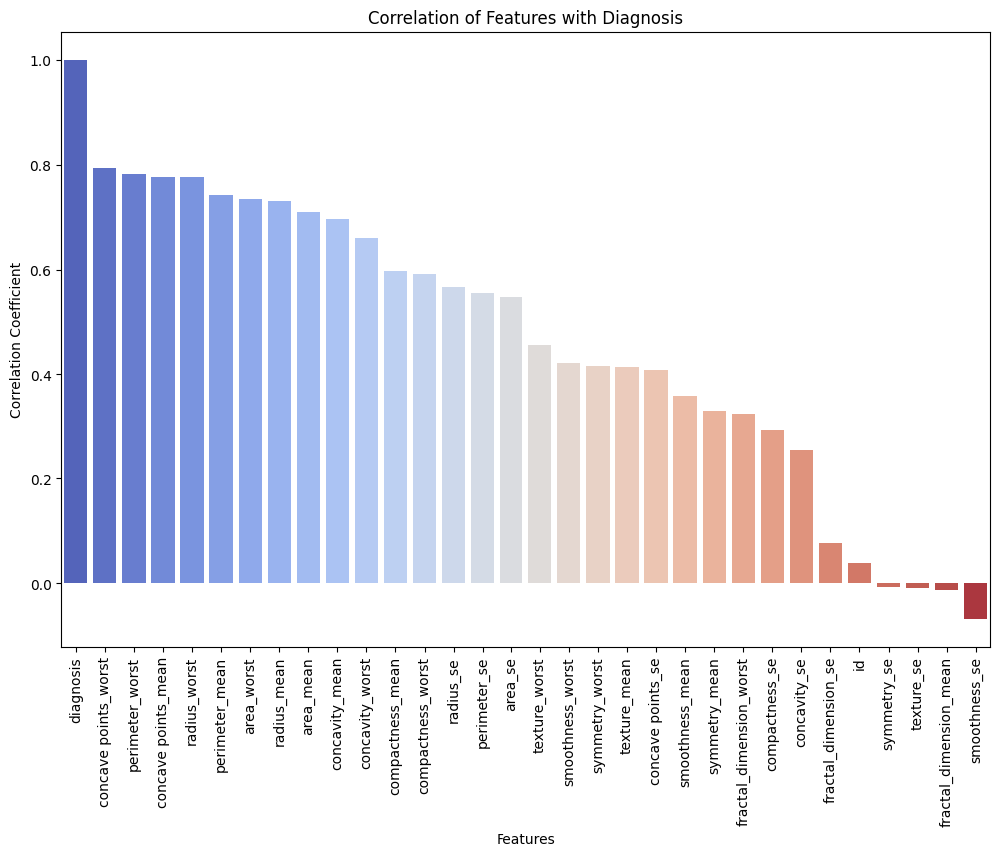
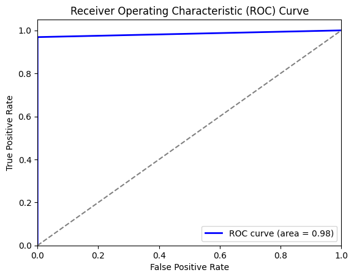
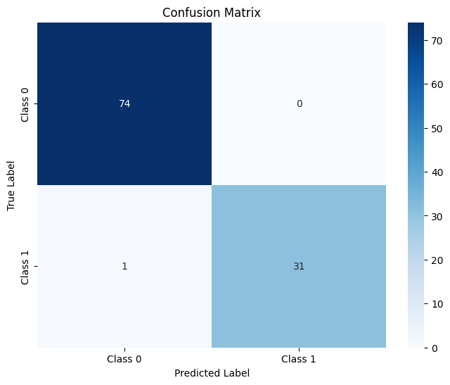

# Breast Cancer Classification using Logistic Regression

This repository contains a machine learning project focused on classifying breast cancer using logistic regression. The goal is to predict whether a tumor is benign or malignant based on various medical attributes. The model achieved an accuracy of 99%.

## Project Overview

Breast cancer is one of the most common cancers among women worldwide. Early detection and accurate diagnosis are crucial for effective treatment. This project aims to assist in the classification of breast cancer using logistic regression, a simple yet powerful classification algorithm.

## Dataset

The dataset used in this project is the [Breast Cancer Wisconsin (Diagnostic) Dataset](https://archive.ics.uci.edu/ml/datasets/Breast+Cancer+Wisconsin+(Diagnostic)), which includes features computed from a digitized image of a fine needle aspirate (FNA) of a breast mass.

## Features

The dataset contains 30 features, including:

- Radius (mean of distances from center to points on the perimeter)
- Texture (standard deviation of gray-scale values)
- Perimeter
- Area
- Smoothness (local variation in radius lengths)
- Compactness
- Concavity
- Concave points
- Symmetry
- Fractal dimension

## Workflow

1. **Data Loading and Initial Exploration**:
   - Load and display the dataset.
   - Display dataset information and summary statistics.

2. **Data Cleaning**:
   - Check for missing values and handle them appropriately.

3. **Exploratory Data Analysis (EDA)**:
   - Check for duplicate rows.
   - Explore and visualize the distribution of the target variable.
   - Encode the target variable ('M' and 'B') into numerical format (1 and 0).
   - Compute and visualize the correlation matrix to understand feature relationships.

4. **Outlier Detection and Removal**:
   - Use box plots to identify and remove outliers.
   - Visualize the distribution of features after outlier removal.

5. **Data Preparation**:
   - Prepare data for modeling by scaling the features.

6. **Model Training and Evaluation**:
   - Split the data into training and testing sets.
   - Train a logistic regression model.
   - Make predictions on the test set.
   - Evaluate model performance using various metrics (accuracy, precision, recall, F1-score).

## Results

The logistic regression model achieved an accuracy of 99% on the test dataset, demonstrating its effectiveness in classifying breast cancer tumors.

### Example Plots

1. **Correlation Heatmap**

   

2. **ROC Curve**

   

3. **Confusion Matrix**

   

## Files

- `data/`: Contains the dataset.
- `notebooks/`: Jupyter notebooks with code for data preprocessing, EDA, model building, and evaluation.
- `src/`: Python scripts for the logistic regression model.
- `images/`: Directory containing the plots used in the README.
- `README.md`: Project overview and documentation.

## How to Use

1. Clone this repository:
   ```bash
   git clone https://github.com/yourusername/breast-cancer-logistic-regression.git
